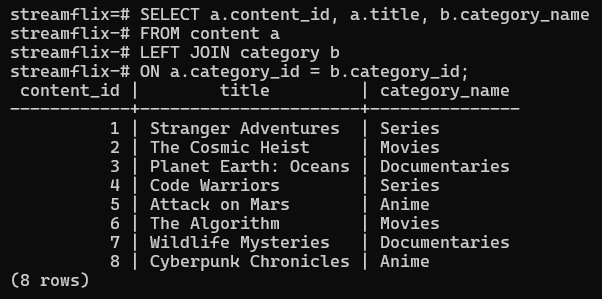
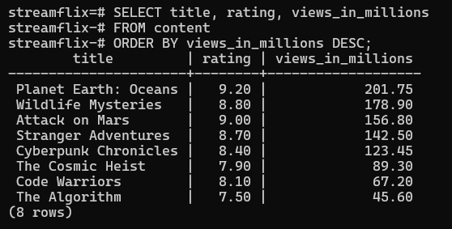
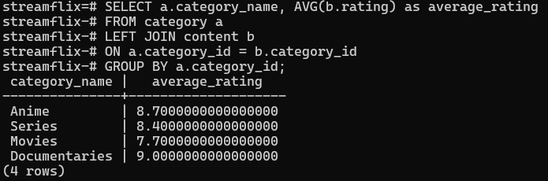
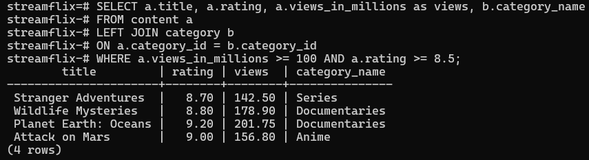
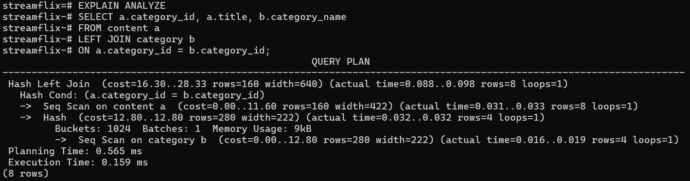
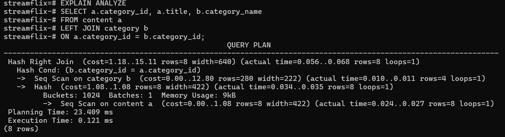

# Database Exercises – SQL Queries


## Question 1

```sql
SELECT a.content_id, a.title, b.category_name
FROM content a
LEFT JOIN category b
ON a.category_id = b.category_id;
```



## Question 2

```sql
SELECT title, rating, views_in_millions
FROM content
ORDER BY views_in_millions DESC;
```



## Question 3

```sql
SELECT a.category_name, AVG(b.rating) AS average_rating
FROM category a
LEFT JOIN content b
ON a.category_id = b.category_id
GROUP BY a.category_id;
```



## Question 4

```sql
SELECT a.title, a.rating, a.views_in_millions AS views, b.category_name
FROM content a
LEFT JOIN category b
ON a.category_id = b.category_id
WHERE a.views_in_millions >= 100
AND a.rating >= 8.5;
```



## Question 5

```sql
EXPLAIN ANALYZE
SELECT a.category_id, a.title, b.category_name
FROM content a
LEFT JOIN category b
ON a.category_id = b.category_id;
```

```sql
CREATE INDEX idx_category_id ON content(category_id);
```
### Before Indexing


### After Indexing



